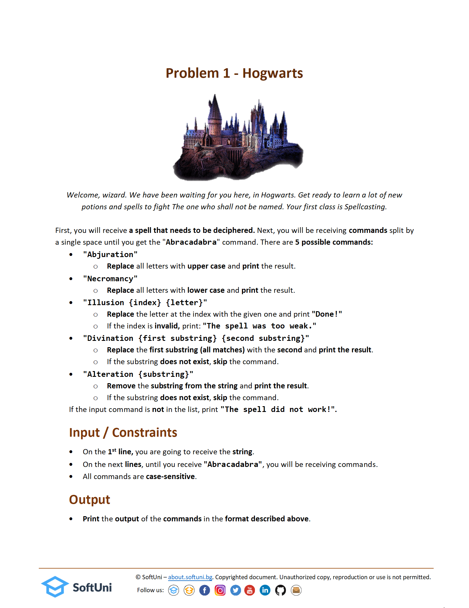
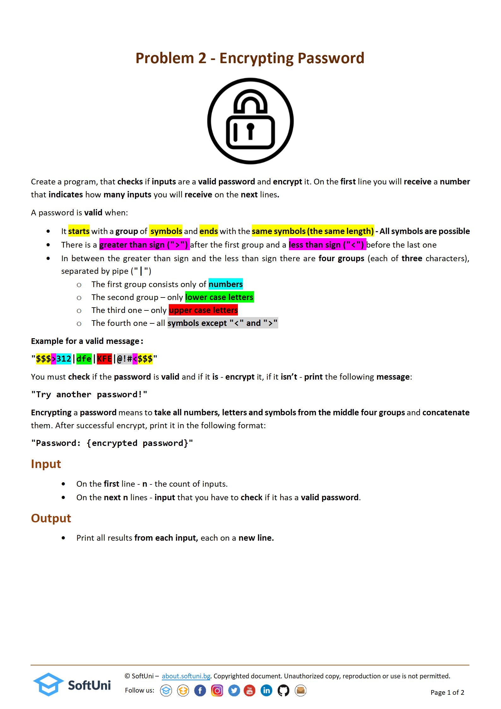
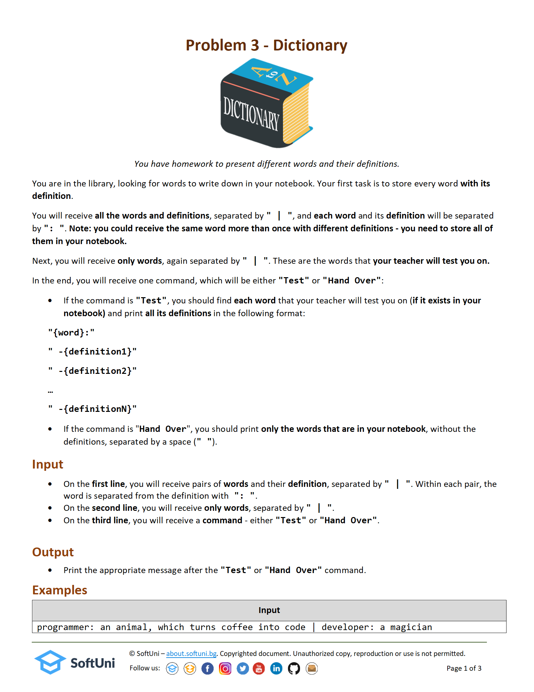

# Final Exam 07.08.2022

### 1. Hogwarts:

#### Test input:

Input:
A7ci0
Illusion 1 c
Illusion 4 o
Abjuration
Abracadabra

Output:
Done!
Done!
ACCIO

Input:
TR1GG3R
Necromancy
Illusion 8 m
Illusion 9 n
Abracadabra

Output:
tr1gg3r
The spell was too weak.
The spell was too weak.

Input:
SwordMaster
Target Target Target
Abjuration
Necromancy
Alteration master
Abracadabra

Output:
The spell did not work!
SWORDMASTER
swordmaster
sword

### 2. Encrypting password:

#### Test input:

Input:
3
##>00|no|NO|!!!?<###
##>123|yes|YES|!!!<##
$$<111|noo|NOPE|<<>$$

Output:
Try another password!
Password: 123yesYES!!!
Try another password!

Input:
5
aa>111|mqu|BAU|mqu<aa
()>111!aaa!AAA!^&*<()
o>088|abc|AAA|***<o
asd>asd|asd|ASD|asd<asd
*>088|zzzz|ZzZ|123<*

Output:
Password: 111mquBAUmqu
Try another password!
Password: 088abcAAA***
Try another password!
Try another password!

### 3. Dictionary:

#### Test input:

Input:
programmer: an animal, which turns coffee into code | developer: a magician
fish | domino
Hand Over

Output:
programmer developer

Input:
care: worry, anxiety, or concern | care: a state of mind in which one is troubled | face: the front part of the head, from the forehead to the chin
care | kitchen | flower
Test

Output:
care:
 -worry, anxiety, or concern 
 -a state of mind in which one is troubled
