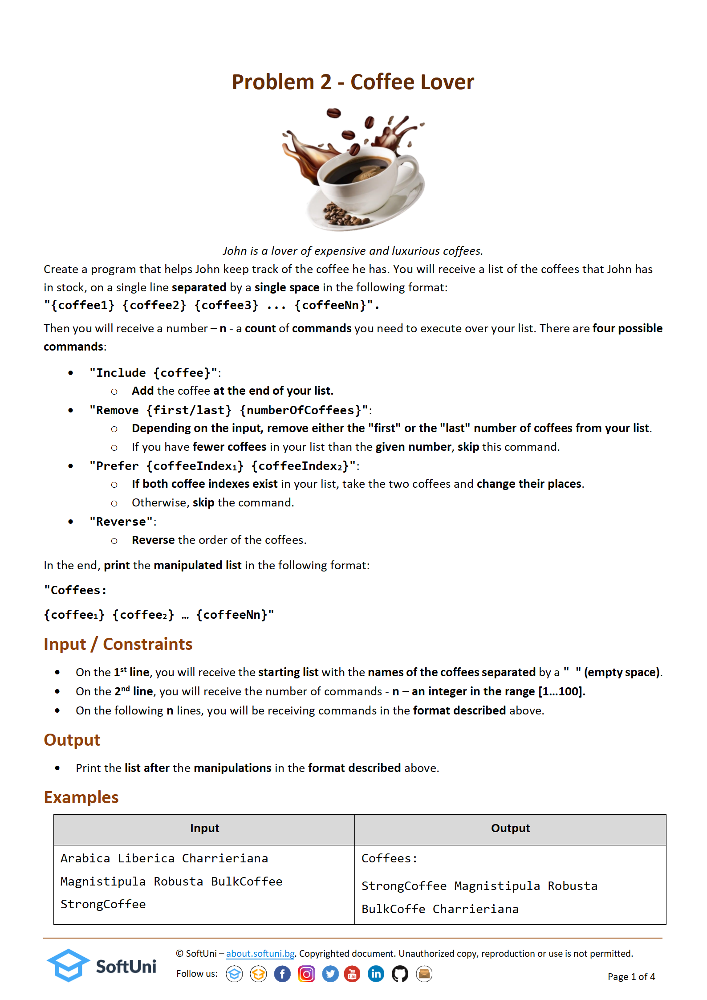
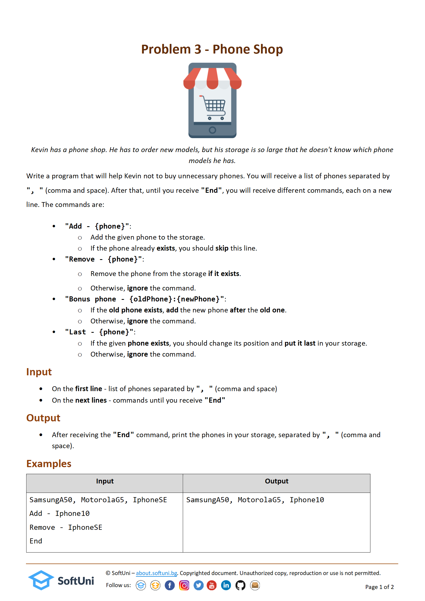

# Lists Basic Exercise
### 1. Burger bus:

The Burger Bus travels around the country and serves delicious burgers. You need to help the owner keep track of his income and expenses along the way.

First, you will receive the number of cities the bus has visited. Then for every city, you will receive:
	- the name of the city
	- how much money the owner earned
	- owner's expenses

Every 3rd (third) city the bus visits, the owner organizes a special event to ensure a true "Burger Bus" experience, spending an additional 50% over costs.

In every 5th (fifth) city, it is raining, and the owner losses 10% of the money earned. In a rainy city, there is no possibility to organize a special event.

You have to calculate the owner's profit for each city and his total profit from the tour. Profit is calculated by deducting the expenses from the income.

#### Input:

The input cosnists of:
	- Number of cities - integer in the range [1...15]
	- For each city, you will receive the following information:
		= name of the city - string
		= owner's income - a real number in the range [0.0...10 000.0]
		= owner's expences - a real number in the range [0.0...10 000.0]
	- The input will always be in the correct format.
#### Output:

- For every city, you need to print the following message:
"In {cityName} Burger Bus earned {profit} leva."
- At the end of the tour, print:
"Burger Bus total profit: {totalProfit} leva."

Note: The profit and the total profit should be formatted to the 2nd decimal place.

#### Test input:
Input:

3
Sofia
895.67
213.50
Plovdiv
2563.20
890.26
Burgas
2360.55
600.00

---------------
Output:

In Sofia Burger Bus earned 682.17 leva.
In Plovdiv Burger Bus earned 1672.94 leva.
In Burgas Burger Bus earned 1460.55 leva.
Burger Bus total profit: 3815.66 leva.

Input:

5
Lille
2226.00
1200.60
Rennes
6320.60
5460.20
Reims
600.20
452.32
Bordeaux
6925.30
2650.40
Montpellier
680.50
290.20

Output:

In Lille Burger Bus earned 1025.40 leva.
In Rennes Burger Bus earned 860.40 leva.
In Reims Burger Bus earned -78.28 leva.
In Bordeaux Burger Bus earned 4274.90 leva.
In Montpellier Burger Bus earned 322.25 leva.
Burger Bus total profit: 6404.67 leva.

### 2. Coffee lover:

#### Test input:

Input:

Arabica Liberica Charrieriana Magnistipula Robusta BulkCoffee StrongCoffee
5
Include TurkishCoffee
Remove first 2
Remove last 1
Prefer 3 1
Reverse

Output:

Coffees:
StrongCoffee Magnistipula Robusta BulkCoffe Charrieriana

Input:

Arabica Robusta BulkCoffee StrongCoffee TurkishCoffee
5
Include OrdinaryCoffee
Remove first 1
Prefer 0 1
Prefer 3 1
Reverse

Output:

Coffees:
OrdinaryCoffee Robusta StrongCoffee TurkishCoffee BulkCoffee

Input:

Robusta StrongCoffee BulkCoffee TurkishCoffee Arabica
3
Include OrdinaryCoffee
Remove first 1
Prefer 4 1

Output:

Coffees:
StrongCoffee OrdinaryCoffee TurkishCoffee Arabica BulkCoffee

### 3. Phone shop:

#### Test input:

Input:

SamsungA50, MotorolaG5, IphoneSE
Add - Iphone10
Remove - IphoneSE
End	

Output:

SamsungA50, MotorolaG5, Iphone10

Input:

HuaweiP20, XiaomiNote
Remove - Samsung
Bonus phone - XiaomiNote:Iphone5
End

Output:

HuaweiP20, XiaomiNote, Iphone5

Input:

SamsungA50, MotorolaG5, HuaweiP10
Last - SamsungA50
Add - MotorolaG5
End

Output:

MotorolaG5, HuaweiP10, SamsungA50

