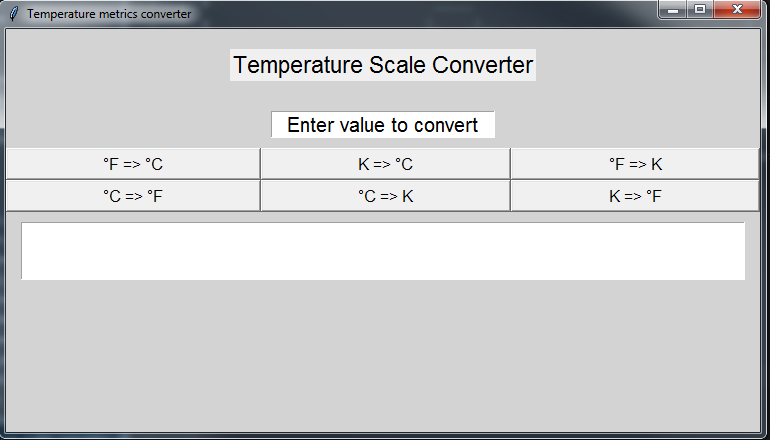
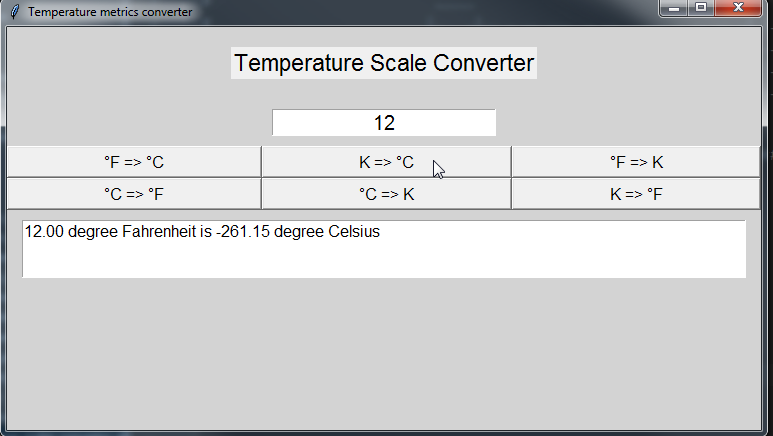

# Tkinter project Temperature Scale Converter

### Description:
This is my first attempt of a monolith GUI project with Tkinter module.

### Used libraries:
* tkinter - https://pypi.org/project/pytemp/
* pytemp - https://docs.python.org/3/library/tkinter.html

### Preview:
* 

*

