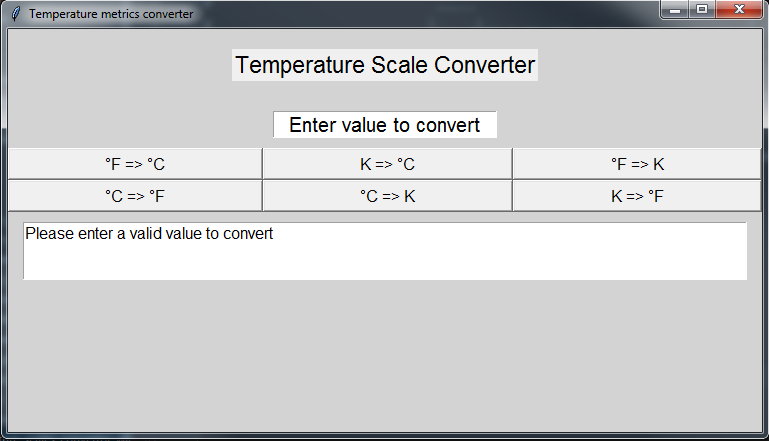
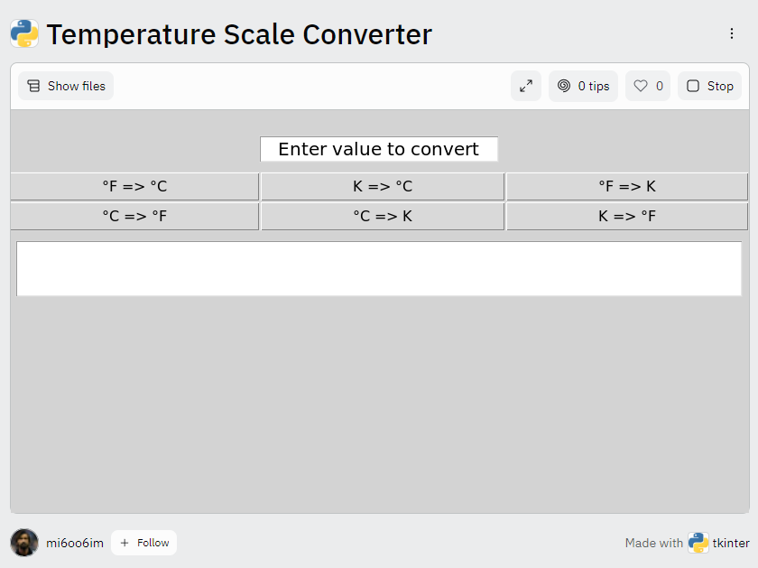

# Tkinter project Temperature Scale Converter

### Description:
This is my first attempt of a monolith GUI project with Tkinter module.

### Used libraries:
* tkinter - https://pypi.org/project/pytemp/
* pytemp - https://docs.python.org/3/library/tkinter.html

### Preview:
* Aplication overview:   

* Value type validation:   

* Output preview:   

### Demo:
* Replit: https://replit.com/@mi6oo6im/Temperature-Scale-Converter#main.py   

### External sources:
* QA https://www.rapidtables.com/convert/temperature/index.html